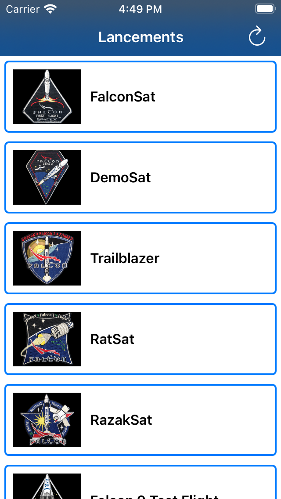
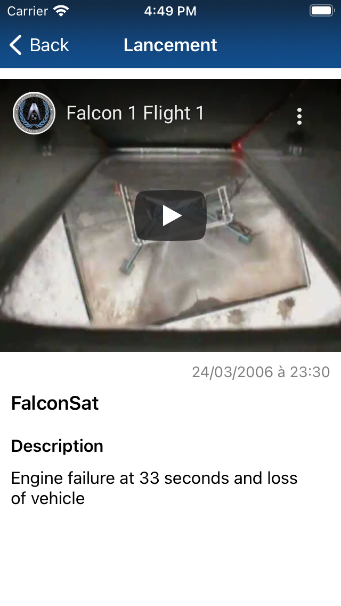
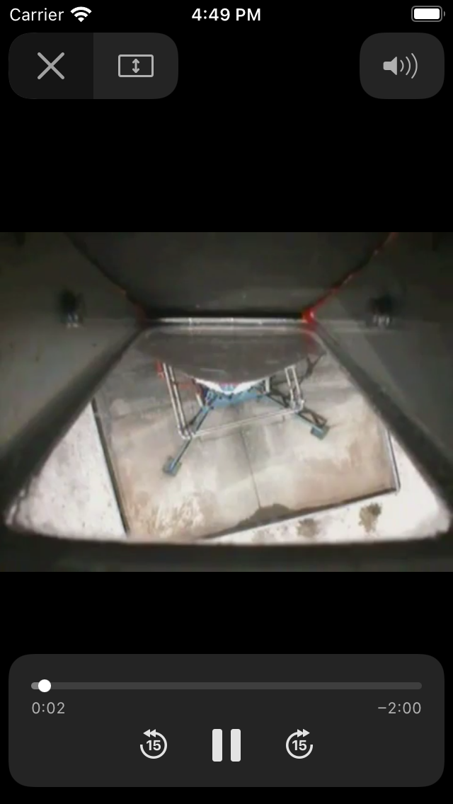
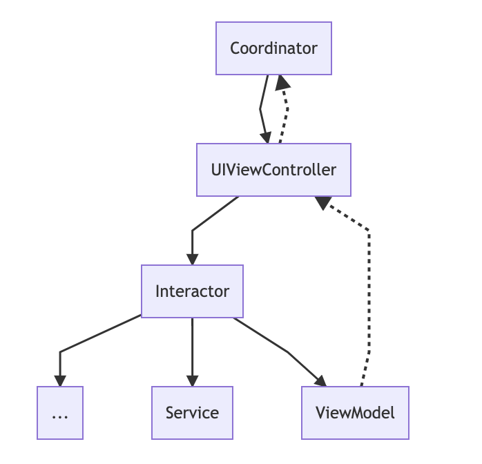

# SpaceLaunches App
* Application showing list of Launchs and details of selected one
* Data is collected from  Api: [https://github.com/r-spacex/SpaceX-API/tree/v2.8.0]
## Screens
  

## Requirement

Xcode 11 / iOS11 / Swift 5.0

## Project setup

Clone project
```
git clone https://github.com/cmoissam/SpaceLaunches.git
```
Run and Enjoy !

## Documentation

### Architecture

This Application use a "MVVM  + interactor + coordinator" architecture.

#### OverView



#### Components

##### UIViewController

Representation of a view.
Must not contains business logic which should be delegated to viewModel, same for navigation
which should be delegated to Coordinator.

##### ViewModel

ViewModel are responsible for UI state representation and formatting logic.
Each ViewController UI update should be triggered by a ViewModel using RxSwift.
ViewModel call Service for store updates.

##### Interactor

Interactor contains application business logic and provide a view model for his target view controller to update his UI.

##### Service

Service do business logic and update store, that notify viewModel for changes

##### Dependencies

For dependencies we use a simple class **SharedAppDependencies** all viewcontroller *must* be created there to don't pollute application code with dependencies configuration.

For the usage only one instance of AppDependencies must be used during application lifetime, so all coordinator should have one reference of it to handle his view controller construction.

## Give feedback

email: issam.lanouari@gmail.com

## Authors

**Lanouari Issam** - *Cmoissam*
